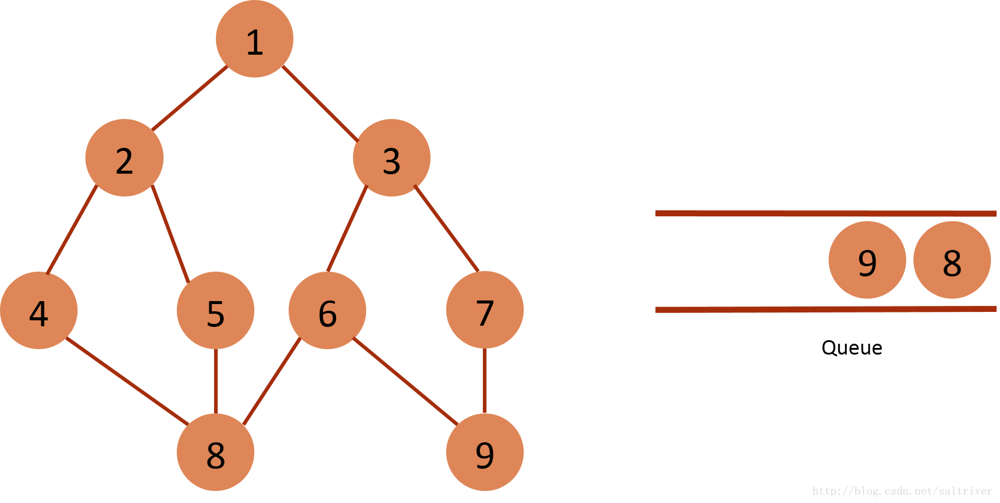

浅谈深度优先搜索(DFS)和广度优先(BFS)搜索

#### 概念理解

一、深度优先搜索

​    深度优先搜索属于图算法的一种，是一个针对图和树的遍历算法，英文缩写为DFS即Depth([depθ]) First Search。深度优先搜索是图论中的经典算法，利用深度优先搜索算法可以产生目标图的相应拓扑排序表，利用拓扑排序表可以方便的解决很多相关的图论问题，如最大路径问题等等。一般用`堆数据结构`来辅助实现DFS算法。`其过程简要来说是对每一个可能的分支路径深入到不能再深入为止，而且每个节点只能访问一次`。


1. 举例说明之：上图是一个无向图，如果我们从A点发起深度优先搜索（以下的访问次序并不是唯一的，第二个点既可以是B也可以是C,D），则我们可能得到如下的一个访问过程：A->B->E（没有路了！回溯到A)->C->F->H->G->D（没有路，最终回溯到A,A也没有未访问的相邻节点，本次搜索结束）。

2. 基本思路
   深度优先遍历图的方法是，从图中某顶点v出发：

   2.1 访问顶点A；
   2.2 依次从A的未被访问的邻接点出发，对图进行深度优先遍历；直至图中和A有路径相通的顶点都被访问；
   2.3 若此时图中尚有顶点未被访问，则从一个未被访问的顶点出发，重新进行深度优先遍历，直到图中所有顶点均被访问过为止。

   从根开始计算，到找到位于某个节点的解，回溯法（深度优先搜索）作为最基本的搜索算法，其采用了一种<font color="red">“一直向下走，走不通就掉头</font>”的思想（体会<font color="red">“回溯”</font>二字），相当于采用了先根遍历的方法来构造搜索树。

3. js代码实现

   优点：实现简单
   缺点：数据层级特别深的情况下，容易发生爆栈

   ```js
   function dfs(root) {   //深度优先遍历的方法
       console.log(root.key);
       root.children.forEach(function (item) {
         dfs(item);    //递归调用
       })
    }
   
   console.log("深度优先搜索的递归实");
   dfs(tree);
   ```

   使用准备的数据，预测结果

   

二、广度优先搜索

​    广度优先搜索（也称宽度优先搜索，缩写BFS）是连通图的一种遍历算法这一算法也是很多重要的图的算法的原型。Dijkstra单源最短路径算法和Prim最小生成树算法都采用了和宽度优先搜索类似的思想。其别名又叫BFS，属于一种盲目搜寻法，目的是系统地展开并检查图中的所有节点，以找寻结果。换句话说，它并不考虑结果的可能位置，彻底地搜索整张图，直到找到结果为止。基本过程，BFS是从根节点开始，沿着树(图)的宽度遍历树(图)的节点。如果所有节点均被访问，则算法中止。一般用队列数据结构来辅助实现BFS算法。

对于下面的树而言，BFS 方法首先从根节点1开始，其搜索节点顺序是 1,2,3,4,5,6,7,8。


BFS 使用队列 (queue) 来实施算法过程，队列 (queue) 有着先进先出 FIFO (First Input First Output)的特性，

BFS 操作步骤如下：

- 把起始点放入 queue；
- 重复下述2步骤，直到 queue 为空为止：

- - 从queue中取出队列头的点；

- - 找出与此点邻接的且尚未遍历的点，进行标记，然后全部放入queue中。

下面结合一个图 (graph) 的实例，说明 BFS 的工作过程和原理：

（1）将起始节点1放入队列中，标记为已遍历：


 （2）从queue中取出队列头的节点1，找出与节点1邻接的节点2,3，标记为已遍历，然后放入queue中。


（3）从queue中取出队列头的节点2，找出与节点2邻接的节点1,4,5，由于节点1已遍历，排除；标记4,5为已遍历，然后放入queue中。


（4）从queue中取出队列头的节点3，找出与节点3邻接的节点1,6,7，由于节点1已遍历，排除；标记6,7为已遍历，然后放入queue中。


（5）从queue中取出队列头的节点4，找出与节点4邻接的节点2,8，2属于已遍历点，排除；因此标记节点8为已遍历，然后放入queue中。


（6）从queue中取出队列头的节点5，找出与节点5邻接的节点2,8，2,8均属于已遍历点，不作下一步操作。


（7）从queue中取出队列头的节点6，找出与节点6邻接的节点3,8,9，3,8属于已遍历点，排除；因此标记节点9为已遍历，然后放入queue中。


（8）从queue中取出队列头的节点7，找出与节点7邻接的节点3, 9，3,9属于已遍历点，不作下一步操作。



（9）从queue中取出队列头的节点8，找出与节点8邻接的节点4,5,6，4,5,6属于已遍历点，不作下一步操作。


（10）从queue中取出队列头的节点9，找出与节点9邻接的节点6,7，6,7属于已遍历点，不作下一步操作。


（11）queue 为空，则遍历结束

js代码实现

```js
function bfs(root) {   //广度优先所有的方法
    let queue = [root];   //创建一个假的队列，其实是数组
    while (queue.length > 0) {
      let node = queue.shift();   //出队队首元素
      console.log(node.key);    //输出节点值
      node.children.forEach((item) => {
        queue.push(item)
      })
    }
 }

console.log("广度优先搜索实现");
bfs(tree);   //调用广度优先搜索方法
```

使用准备的数据，预测结果


#### DFS和BFS的区别

`广度优先搜索`： 广度优先搜索是按照树的层次进行的搜索，如果此层没有搜索完成的情况下不会进行下一层的搜索。

`深度优先搜索`： 深度优先搜索是按照树的深度进行搜索的，所以又叫纵向搜索，在每一层只扩展一个节点，直到为树的规定深度或叶子节点为止。这个便称为深度优先搜索。

BFS一般需存储产生的所有节点，占的存储空间要比深度优先大的多。因此程序设计中，必须考虑溢出和节省内存空间的问题。但深度优先搜索容易爆栈，而广度优先搜索可以自己控制队列的长度。
比较深度优先和广度优先两种搜索法，[广度优先搜索](http://www.baidu.com/s?wd=广度优先搜索&ie=gbk&tn=SE_hldp00990_u6vqbx10)法一般无回溯操作，即人栈和出栈的操作，所以运行速度比[深度优先搜索](http://www.baidu.com/s?wd=深度优先搜索&ie=gbk&tn=SE_hldp00990_u6vqbx10)法要快些。
总之，一般情况下，[深度优先搜索](http://www.baidu.com/s?wd=深度优先搜索&ie=gbk&tn=SE_hldp00990_u6vqbx10)法占内存少但速度较慢，[广度优先搜索](http://www.baidu.com/s?wd=广度优先搜索&ie=gbk&tn=SE_hldp00990_u6vqbx10)法占内存较多但速度较快，在距离与深度成正比的情况下能较快的求出最优解。因此在选择用那种算法时，要综合考虑，决定取舍。

一般来说，能用DFS解决的问题，都能用BFS。

#### 应用实例

后端会有较多的业务逻辑应用场景。。。前端比较熟悉的有：

1. react的diff算法。

   React 的diff 算法采用了深度优先遍历算法。 因为广度优先遍历可能会导致组件的生命周期时序错乱，而深度优先遍历算法就可以解决这个问题。 ... 两个相同组件产生类似的DOM 结构，不同的组件产生不同的DOM 结构； 对于同一层次的一组子节点，它们可以通过唯一的id 进行区分。


备用数据：

```js
const tree = {
    key: '第一层-1',
    children: [
      {
        key: '第二层-1-1',
        children: [
          {
            key: '第三层-1-1',
            children: [],
          },
          {
            key: '第三层-1-2',
            children: [],
          }
        ]
      },
      {
        key: '第二层-2-1',
        children: [
          {
            key: '第三层-2-1',
            children: [],
          }
        ]
      },
      {
        key: '第二层-3-1',
        children: [
          {
            key: '第三层-3-1',
            children: [],
          }
        ]
      },
    ]
  }
```

该数据对应的图：


#### 补充

深度优先搜索也可以通过非递归方式实现
优点：搜索速度快，不会发生爆栈

缺点：必须使用额外的内存空间，用以保存递归时程序的运行状态。

循环是人，递归是神：所有的程序在计算机底层都会转化成顺序执行的指令序列，递归函数也不例外，所以是有通用的方法将递归函数转化成迭代的函数的。
一般来说，我们会比较容易想到某个问题的递归解法。这是因为递归函数隐藏了一些执行的细节，是一种抽象程度更高的程序写法。想要将它转化成迭代执行，我们首先要了解哪些细节被隐藏了，写法会变得复杂。

如果使用递归的时候怕爆栈可以考虑使用编译参数调整递归最大次数，或者检查一下是否有死循环。

```js
const deepTraversal2 = (node) => {
    let stack = []
    let nodes = []

    if (node) {
        stack.push(node)
        
        while(stack.length) {
            const temp = stack.pop()
            const children = temp.children

            nodes.push(temp)

            for(let i = children.length-1; i >=0; i--) {
                stack.push(children[i])
            }
        }
    }
    return nodes
}
console.log('深度优先搜索的非递归实现');
console.log(deepTraversal2(tree))
```


------

参考文档：

https://www.jianshu.com/p/bff70b786bb6

https://www.cnblogs.com/bejamin/p/13472366.html

https://blog.csdn.net/qq_38670588/article/details/108267028

https://developer.51cto.com/art/202004/614590.htm

https://www.cnblogs.com/huansky/p/12826857.html

