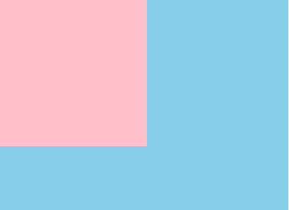
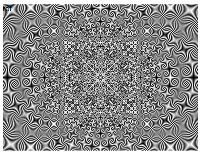
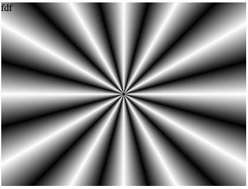

## 一行 CSS 代码的魅力

之前在知乎看到一个很有意思的讨论 [**一行代码可以做什么？**](https://www.zhihu.com/question/285586045/answer/754139603)

那么，一行 CSS 代码又能不能搞点事情呢？

### 谁的代码更短

[CSS Battle](https://juejin.cn/post/cssbattle.dev) 网站上曾经有过一道题：

给定下面这样一张图形，告诉你 HTML 的大小是 `400px` x `300px`，图片中使用到的颜色是 `pink, skyblue`，你会怎么用 CSS 去实现它呢？**注意是，完全一模一样还原**。



因为要求，字符数越少，分数越高，当然是选字符少的标签，是不是这样：

```html
<p />
<style>
body {
  background: skyblue;
}
p {
  width: 200px;
  height: 200px;
  background: pink;
}
</style>
```

这样当然可以，但是看看文章的标题，一行 CSS ？这明显不是啊，并且这里有 100+ 个字符。我们得把字符数压一压。

嗯嗯嗯，想到了阴影，尝试下使用 [box-shadow](https://developer.mozilla.org/zh-CN/docs/Web/CSS/box-shadow)：

```html
<a>
<style>
a {
    box-shadow:0 0 0 200px pink, 0 0 0 400px skyblue;
  // x偏移量 | y偏移量 | 阴影模糊半径 | 阴影扩散半径 | 阴影颜色
  // box-shadow可以对同一个元素添加多个阴影效果，使用逗号将每个阴影规则分隔开
}
</style>
```

利用两层阴影，完美实现图例图形，并且，字符数压缩到了 82 个。当然，这还不是极致，我们完全可以内联 CSS，再减少字符数：

```html
<a style="box-shadow:0 0 0 200px pink, 0 0 0 400px skyblue">
```

只有 62 个字符。当然，从一行代码的角度，这个问题完美的解决了，如果追求极致的字符数，上述的代码还可以再简化一下：

```html
<a style=box-shadow:0+0+0+200px#b5e0ba,0+0+0+5in#5d3a3a>
// 注：这里的颜色需要用十六进制表示，否则会识别不出来
```

> 这里有一些小知识点，HTML5 支持属性后面不用引号包住，又譬如 `box-shadow:  0 0 0 400px #5d3a3a 是可以压缩到 `box-shadow:0+0+0+5in#5d3a3a`。
>
> 1in是1英尺；In用于物理符号，包括额定电流和量器符号。CSS 中 `1in=96px`，但是画布只有 400px，5in 大于 400px，也没有问题，能够充满画布。

### 一行背景代码

要说到 CSS 最有意思的属性，我觉得背景（background）肯定能够获得很多选票。背景分为：

- 纯色

- 线性渐变(`linear-gradient`)

- 径向渐变(`radial-gradient`)

- 角向渐变(`conic-gradient`)

- 多重线性渐变(`repeating-linear-gradient`)

- 多重径向渐变(`repeating-radial-gradient`)

- 多重角向渐变(`repeating-conic-gradient`)

突出一个字，离谱。并且它们还可以互相混合、叠加添加滤镜、配合各种背景相关属性等等等。

不过今天，来看看一行 CSS Background 代码能玩出什么花来。嗯？这里的主角是多重角向渐变(`repeating-conic-gradient`)，只用一行 CSS 代码：

```css
<style>
    .box {
        width: 400px;
        height: 300px;
        background: repeating-conic-gradient(#fff, #000, #fff 0.1deg);
        margin: 100px auto;
    }
</style> 
<body>
    <div class="box">fdf</div>
</body>
```

这什么玩意？脑补一下，这行代码绘制出来的图形会是什么样子？看看：



Wow，不可思议。这里 `0.1deg` 非常关键，这里的角度越小（小于 1deg 为佳），图形越酷炫。

我们把 `0.1deg` 替换成 `30deg` 看看：

```css
background: repeating-conic-gradient(#fff, #000, #fff 30deg);
```



当然也非常好看，只不过没有上面那个那么惊艳。

附加：考虑以下的优惠券怎么实现？


```html
<style>
    .box {
        position: relative;
        margin: 200px auto 0;
        width: 180px;
        height: 90px;
        background: linear-gradient(to right, rgb(255, 85, 85), rgb(207, 224, 232));
        padding: 10px 20px;
        box-sizing: border-box;
        color: #fff;
    }
    .zhekou {
        font-size: 22px;
        margin: 0px;
    }
    .tiaojian {
        font-size: 12px;
    }
    .circle1 {
        position: absolute;
        z-index: 5;
        top: -8px;
        left: 0;
        transform-origin: center left;
        transform: rotate(90deg);
        width: 220px;
        height: 9px;
      // 主要就是我这句代码哦~
        background-image: radial-gradient(circle, #fff 4px, transparent 1px);
        background-size: 10px 10px;
        background-repeat: repeat-x;
    }
</style> 
<body>
    <div class="box">
        <p class="zhekou">8折</p>
        <p class="tiaojian">满10元可用</p>
        <div class="circle1"></div>
    </div>
</body>
```

### 老生常谈之 - 垂直水平居中

常用的就不说了，比如：

```css
1. margin: 0 auto; // 高度需要根据已知的写死，不推荐
2. display: flex; align-items: center; justify-content: center; // flex存在兼容问题
3. position: relative; left: 50%; top: 50%; transform: translate(-50%, -50%); // transform存在兼容问题
4. display: table-cell; text-align: center;	vertical-align: middle; // 无兼容性问题
...
```

#### flex布局下的margin： auto

```html
<style>
.container {
 	width: 500px;
  height: 500px;
  background-color: skyblue;
  
  display: flex;
}
.box {
  width: 200px;
  height: 200px;
  background-color: pink;
  
  margin: auto;
}
</style> 
<body>
  <div class="container">
    <div class="box"></div>
  </div>
</body>
```

> 上面的 `display: flex` 替换成 `display: inline-flex | grid | inline-grid` 也是可以的。

在 `display: flex` 布局下， `margin auto` 的生效不仅是水平方向，垂直方向也会自动去分配这个剩余空间。

#### `grid` 布局下的 `place-items: center`

```css
<style>
    .container {
        width: 500px;
        height: 500px;
        background-color: greenyellow;

        display: grid;
        place-items: center;
}

.box {
    width: 200px;
    height: 200px;
    background-color: pink;
}
</style> 
<body>
    <div class="container">
        <div class="box"></div>
    </div>
</body>
```


---

参考文档：

https://juejin.cn/post/6914471841327218702

