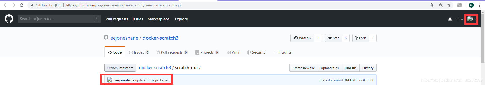
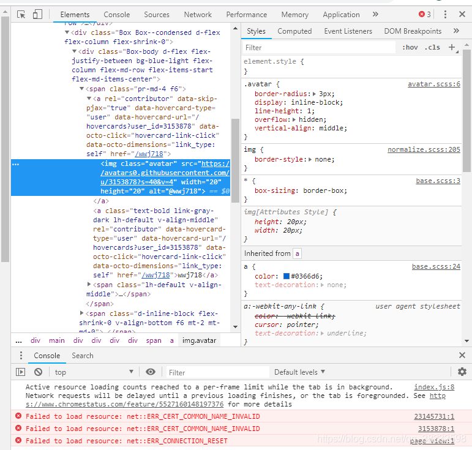
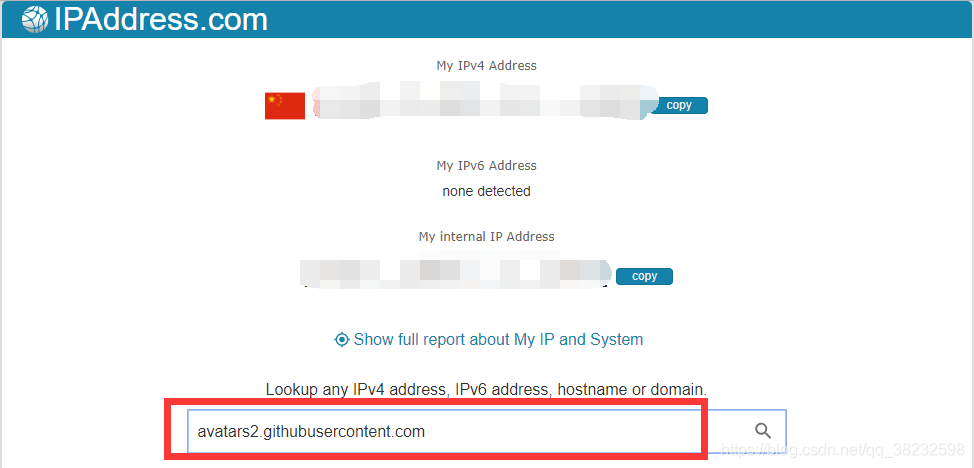
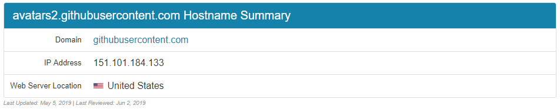

### 一、问题

随便打开一个github的项目，发现图片都不能显示了，连头像也不显示了。



打开控制台看一下



一堆红色×。主要报错是`Failed to load resource: net::ERR_CERT_COMMON_NAME_INVALID`

去查了一下，博主[john-zeng](https://blog.csdn.net/zerooffdate/article/details/80513730)这样解释道：

```
实际上，可以认为，ERR_CERT_COMMON_NAME_INVALID就是用一个错误的域名访问了某个节点的https资源。导致这个错误的原因，基本是：
1. dns污染
2. host设置错误
3. 官方更新了dns，但是dns缓存没有被更新，导致错误解析。
```

我觉得像是有点道理，解决方法就粗来了。

### 二、解决方法

主要思路就是使用本地`hosts`文件对网站进行域名解析，一般的`DNS`问题都可以通过修改`hosts`文件来解决，`github`的`CDN`域名被污染问题也不例外，同样可以通过修改`hosts`文件解决，将域名解析直接指向`IP`地址来绕过`DNS`的解析，以此解决污染问题。

#### 2.1 找到URL

打开`github`任意未显示图片的网页，使用元素选择器放在显示不了的图片上，或者在无法显示的图片上右键-检查元素，定位到该图片的标签，那么你得到了它的URL，叫做`src`属性。

比如介个


在右面把它的网址复制粗来：

```
https://avatars2.githubusercontent.com/u/15832957?s=60&v=4
```

#### 2.2 获取IP地址

得到上述网址以后打开[IPAddress.com](https://www.ipaddress.com/)这个网站，在搜索框输入它的域名，就是`https://`到`com`那一部分，俗称二级域名：

```
avatars2.githubusercontent.com
```



回车！！！下面你会看到该域名的信息和`IP`地址：



可以看出IP是：`151.101.184.133`，并且是2019.05.05最后更新的，alright，那么我们就可以使这个**IP**和**域名**映射起来。

（其他如果有挂掉的图片一样使用此方法进行一一映射即可。）

#### 2.3 修改hosts

具体咋映射呢？修改`hosts`文件！！！本人使用的是mac系统，通过命令 vim /etc/hosts打开hosts文件

在文件末尾添加：

```
# GitHub Start 
140.82.113.3      github.com
140.82.114.20     gist.github.com

151.101.184.133    assets-cdn.github.com
151.101.184.133    raw.githubusercontent.com
151.101.184.133    gist.githubusercontent.com
151.101.184.133    cloud.githubusercontent.com
151.101.184.133    camo.githubusercontent.com
151.101.184.133    avatars0.githubusercontent.com
199.232.68.133     avatars0.githubusercontent.com
199.232.28.133     avatars1.githubusercontent.com
151.101.184.133    avatars1.githubusercontent.com
151.101.184.133    avatars2.githubusercontent.com
199.232.28.133     avatars2.githubusercontent.com
151.101.184.133    avatars3.githubusercontent.com
199.232.68.133     avatars3.githubusercontent.com
151.101.184.133    avatars4.githubusercontent.com
199.232.68.133     avatars4.githubusercontent.com
151.101.184.133    avatars5.githubusercontent.com
199.232.68.133     avatars5.githubusercontent.com
151.101.184.133    avatars6.githubusercontent.com
199.232.68.133     avatars6.githubusercontent.com
151.101.184.133    avatars7.githubusercontent.com
199.232.68.133     avatars7.githubusercontent.com
151.101.184.133    avatars8.githubusercontent.com
199.232.68.133     avatars8.githubusercontent.com

# GitHub End
```

然后保存文件就OK了，至于无法保存，没有修改权限，鼠标右键-属性-安全-修改权限；或将`hosts`文件复制一份，修改之后，复制到原文件夹替换！

### 三、最后说几句

还可以使用`ipconfig/flush`对本地DNS缓存进行一次刷新，如果遇到网络异常，可能是DNS缓存的问题，刷新一下，步骤。

1. windows开始→运行→输入：CMD 按回车键，打开命令提示符窗口。
2. 再输入： ipconfig /flushdns 回车,执行命令，可以重建本地DNS缓存。

再附上几个命令：

```
ipconfig /displaydns # 显示dns缓存 

ipconfig /flushdns # 刷新DNS记录 

ipconfig /renew # 重请从DHCP服务器获得IP 
```

PS：另外要注意的一点就是，如果图片再次不能显示，只需要及时更新IP就行啦，这波操作不麻烦，你看我头像回来了！！！

----

参考文档：https://blog.csdn.net/qq_38232598/article/details/91346392