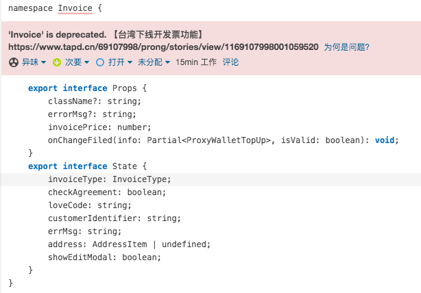
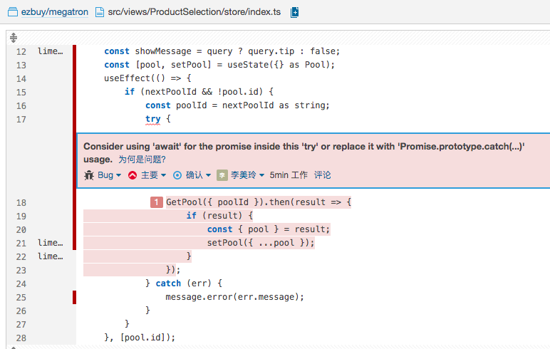
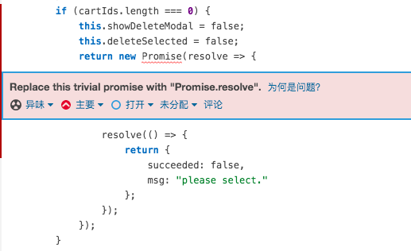
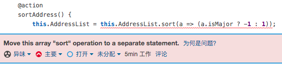

### 一、better code

1. 

   一旦弃用，类和接口及其成员应该被避免，而不是使用、继承或扩展。弃用是警告类或接口已被取代，并将最终被删除。报废期可以让您顺利地摆脱老化的、即将退役的技术。

2. 



Noncompliant Code Example

```js
function runPromise() {
  return Promise.reject("rejection reason");
}

function foo() {
  try { // Noncompliant, the catch clause of the 'try' will not be executed for the code inside promise
    runPromise();
  } catch (e) {
    console.log("Failed to run promise", e);
  }
}
```

Compliant Solution

```js
function foo() {
  runPromise().catch(e => console.log("Failed to run promise", e));
}

// or
async function foo() {
  try {
    await runPromise();
  } catch (e) {
    console.log("Failed to run promise", e);
  }
}
```

当我们使用 `async/await` 时，几乎就不会用到 `.then` 了，因为 `await` 为我们处理了等待。并且我们使用常规的 `try..catch` 而不是 `.catch`

**补充知识点：使用 promise 进行错误处理 - [隐式 try…catch](https://zh.javascript.info/promise-error-handling#yin-shi-trycatch) **

Promise 的执行者（executor）和 promise 的处理程序（handler）周围有一个“隐式的 `try..catch`”。如果发生异常，它（译注：指异常）就会被捕获，并被视为 rejection 进行处理。

例如，下面这段代码：

```javascript
new Promise((resolve, reject) => {
  throw new Error("Whoops!");
}).catch(alert); // Error: Whoops!
```

……与下面这段代码工作上完全相同：

```javascript
new Promise((resolve, reject) => {
  reject(new Error("Whoops!"));
}).catch(alert); // Error: Whoops!
```

在 executor 周围的“隐式 `try..catch`”自动捕获了 error，并将其变为 rejected promise。

这不仅仅发生在 executor 函数中，同样也发生在其 handler 中。如果我们在 `.then` 处理程序（handler）中 `throw`，这意味着 promise 被 rejected，因此控制权移交至最近的 error 处理程序（handler）。

这是一个例子：

```javascript
new Promise((resolve, reject) => {
  resolve("ok");
}).then((result) => {
  throw new Error("Whoops!"); // reject 这个 promise
}).catch(alert); // Error: Whoops!
```

对于所有的 error 都会发生这种情况，而不仅仅是由 `throw` 语句导致的这些 error。例如，一个编程错误：

```javascript
new Promise((resolve, reject) => {
  resolve("ok");
}).then((result) => {
  blabla(); // 没有这个函数
}).catch(alert); // ReferenceError: blabla is not defined
```

最后的 `.catch` 不仅会捕获显式的 rejection，还会捕获它上面的处理程序（handler）中意外出现的 error。

#### 2. Promise.resolve(v)与new Promise(r => r(v))



Noncompliant Code Example

```js
let fulfilledPromise = new Promise(resolve => resolve(42));
let rejectedPromise = new Promise(function(resolve, reject) {
  reject('fail');
});
```

Compliant Solution

```js
let fulfilledPromise = Promise.resolve(42);
let rejectedPromise = Promise.reject('fail');
```

当Promise只需要"resolve"或"reject"时，使用专门为这类用例创建的方法会更加有效和易读:Promise.resolve(value)和Promise.reject(error)。

如果v是 Promise 实例，这种情况下new Promise(r => r(v))和Promise.resolve(v)会产生不一样的效果（实际就是事件循环）。

```js
// 在promise里面resolve一个状态为fulfilled的promise

// v是一个实例化的promise，且状态为fulfilled
const v = new Promise(resolve => {
  console.log("begin");
  resolve("then");
});

  // 模式一 new Promise里的resolve()
  // begin->1->2->3->then->4 可以发现then推迟了两个时序
  // 推迟原因：浏览器会创建一个 PromiseResolveThenableJob 去处理这个 Promise 实例，这是一个微任务。
  // 等到下次循环到来这个微任务会执行，也就是PromiseResolveThenableJob 执行中的时候，因为这个Promise 实例是fulfilled状态，所以又会注册一个它的.then()回调
  // 又等一次循环到这个Promise 实例它的.then()回调执行后，才会注册下面的这个.then(),于是就被推迟了两个时序
  new Promise(resolve => {
    resolve(v);
  }).then((res)=>{
    console.log(res)
  });

  // 模式二 Promise.resolve(v)直接创建
  // begin->1->then->2->3->4 可以发现then的执行时间正常了，第一个执行的微任务就是下面这个.then
  // 原因：Promise.resolve()API如果参数是promise会直接返回这个promise实例，不会做任何处理
  // Promise.resolve(v).then((res)=>{
  //   console.log(res)
  // });

new Promise(resolve => {
  console.log(1);
  resolve();
})
  .then(() => {
    console.log(2);
  })
  .then(() => {
    console.log(3);
  })
  .then(() => {
    console.log(4);
  });
```

**resolve()本质作用**

- resolve()是用来表示promise的状态为fullfilled，相当于只是定义了一个有状态的Promise，但是并没有调用它；
- promise调用then的前提是promise的状态为fullfilled；
- 只有promise调用then的时候，then里面的函数才会被推入微任务中；

3. 

Noncompliant Code Example

```js
// sort、reverse 会改变原数组
var b = a.reverse(); // Noncompliant
var d = c.sort(); // Noncompliant 
```

Compliant Solution

```js
var b = [...a].reverse();  // 解构结构并创建一个新数组，因此反向不会影响'a'
a.reverse();
c.sort(); // this sorts array in place
```


Q: 在你使用 `npm link` 或等效方案时可能会有 调用了两个 Reac的问题。在这种情况下，你的打包器会“检测”到两个 React —— 一个在应用项目文件夹中，另一个在你的工具库文件夹中。

A: 项目node_module/react中yarn link抛出react，工具库中使用项目中抛出的react：yarn link "react"，即可。

https://zh-hans.reactjs.org/warnings/invalid-hook-call-warning.html